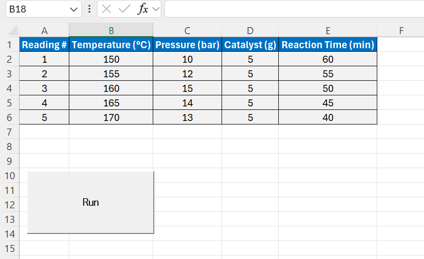
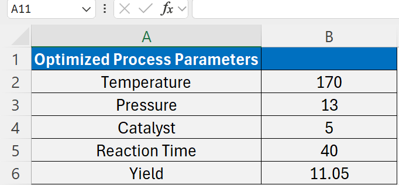
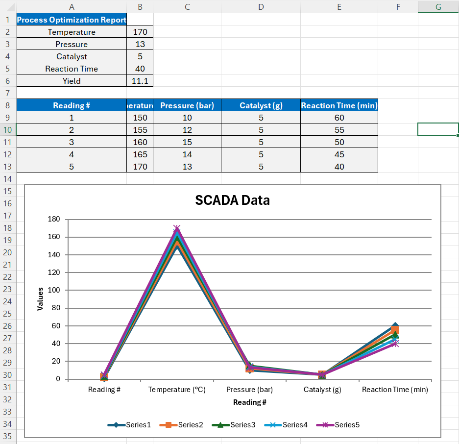
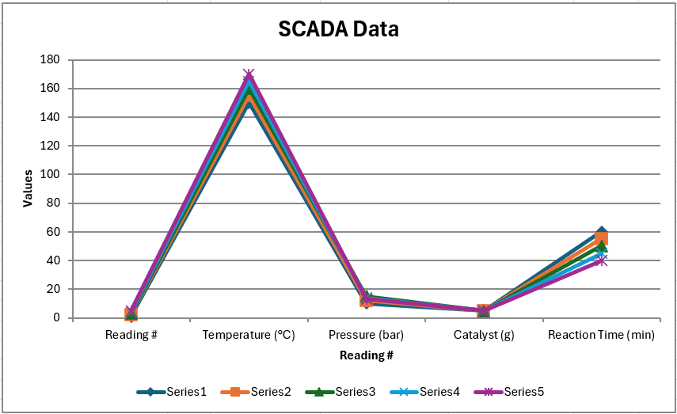

# SCADA-Based Chemical Process Optimization Tool

## Overview
This project demonstrates the optimization of chemical process parameters using SCADA data and VBA in Excel. It aims to streamline the process of data analysis and optimization for chemical engineers by automating calculations and generating visualizations.

## Features
- Automatically generates charts based on SCADA data.
- Optimizes yield and cost based on provided parameters.
- Provides a user-friendly interface for inputting data and viewing results.

## Screenshots

### Input Tab
This tab is where you input the process parameters and SCADA data.

### Optimization Tab
This tab shows the optimization process and results.

### Report Tab
This tab contains the final report with optimized parameters and visualizations.

### Report Graph
An example of the automatically generated graph in the report tab.

## How to Use
1. **Download the Excel File**:
   - Download the `Sadiq_SCADA-Based_Chemical_Process_Optimization_Tool.xlsm` file from this repository.

2. **Open the File in Excel**:
   - Make sure macros are enabled in your Excel settings.

3. **Input Data**:
   - Navigate to the `Input` tab.
   - Enter your process parameters and SCADA data.

4. **Run Optimization**:
   - Go to the `Optimization` tab and click the button to run the optimization process.

5. **View Results**:
   - Check the `Report` tab for the final results and generated graph.

## VBA Code
The VBA code used for optimization is provided in the [`optimization_code.bas`](optimization_code.bas) file. You can import this code into your own Excel projects if needed.

## Files Included
- **`Sadiq_SCADA-Based_Chemical_Process_Optimization_Tool.xlsm`**: The main Excel file containing the tool.
- **`screenshots/`**: A folder containing screenshots of the different tabs in the Excel tool.
- **`vba/optimization_code.bas`**: The VBA code used in this project.

## Requirements
- Microsoft Excel with macro support enabled.
- Basic understanding of SCADA data and chemical process optimization.

---

Hope you find this tool useful for optimizing your chemical processes!
